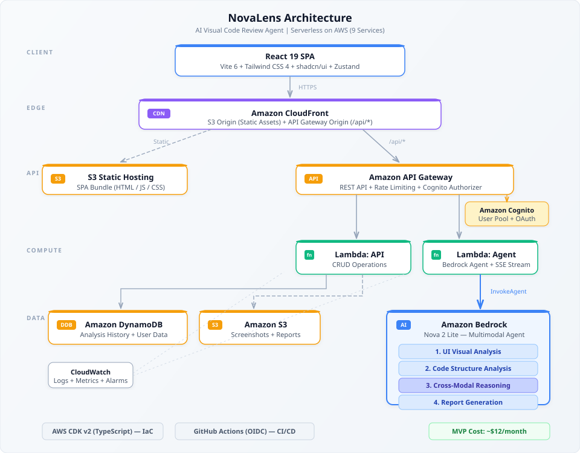

# NovaLens

**AI Visual Code Review Agent** — Cross-modal analysis of UI screenshots and source code powered by Amazon Bedrock.

[English](./README.md) | [한국어](./README.ko.md)

---

## What is NovaLens?

NovaLens is an AI-powered agent that detects visual-code inconsistencies by cross-analyzing **UI screenshots** and **frontend source code** simultaneously. Unlike existing tools that inspect code OR visuals in isolation, NovaLens bridges both modalities to uncover issues that fall through the cracks.

**Core capabilities:**
- **UI Visual Analysis** — Layout, color contrast, spacing, and typography issues detected from screenshots
- **Code Structure Analysis** — Semantic HTML, ARIA attributes, CSS problems, and responsive design checks
- **Cross-Modal Reasoning** — The key differentiator: AI reasons across image and code to find inconsistencies
- **Actionable Reports** — Prioritized issues with WCAG violation details and fix suggestion code

## Architecture

<p align="center">
  
</p>

## Tech Stack

| Layer | Technology |
|-------|-----------|
| Frontend | React 19 + Vite 6 + TypeScript |
| Styling | Tailwind CSS 4 + shadcn/ui |
| State | Zustand |
| Backend | AWS Lambda (Node.js 22) + API Gateway |
| Database | Amazon DynamoDB (on-demand) |
| Storage | Amazon S3 |
| Auth | Amazon Cognito |
| AI | Amazon Bedrock (Nova 2 Lite + Agent) |
| CDN | Amazon CloudFront |
| IaC | AWS CDK v2 (TypeScript) |
| CI/CD | GitHub Actions (OIDC) |
| Test | Vitest + Playwright |

## AWS Services (9)

| # | Service | Role |
|---|---------|------|
| 1 | Amazon Bedrock | Nova 2 Lite + Agent (AI core) |
| 2 | AWS Lambda | Backend API + Agent Controller |
| 3 | Amazon API Gateway | REST API + Cognito Auth + Rate Limiting |
| 4 | Amazon S3 | Frontend hosting + Screenshot/Report storage |
| 5 | Amazon CloudFront | CDN |
| 6 | Amazon DynamoDB | Analysis history, user data |
| 7 | Amazon Cognito | Authentication (User Pool + OAuth) |
| 8 | AWS CDK v2 | Infrastructure as Code |
| 9 | Amazon CloudWatch | Logging, monitoring, alarms |

## Getting Started

### Prerequisites

- Node.js 22+
- AWS CLI configured
- AWS CDK v2 installed (`npm i -g aws-cdk`)

### Installation

```bash
# Clone the repository
git clone https://github.com/buddypia/novalens.git
cd novalens

# Install dependencies
cd frontend && npm install
cd ../backend && npm install
cd ../infra && npm install
```

### Development

```bash
# Start frontend dev server (localhost:3001)
cd frontend && npm run dev

# Build backend Lambda bundles
cd backend && npm run build

# Type check
cd frontend && npm run typecheck
cd backend && npm run typecheck
```

### Testing

```bash
# Frontend unit tests
cd frontend && npm run test

# Frontend E2E tests
cd frontend && npm run test:e2e

# Backend unit tests
cd backend && npm run test
```

### Deployment

```bash
# Synthesize CloudFormation template
cd infra && npx cdk synth

# Preview changes
cd infra && npx cdk diff

# Deploy
cd infra && npx cdk deploy
```

## Project Structure

```
novalens/
├── frontend/               # React 19 + Vite 6 SPA
│   ├── src/
│   │   ├── features/       # Feature-first architecture
│   │   │   └── analysis/   # Core analysis feature
│   │   │       ├── components/
│   │   │       ├── hooks/
│   │   │       ├── api/
│   │   │       └── types/
│   │   ├── shared/         # Shared components, hooks, utils
│   │   └── config/         # App configuration
│   └── tests/
├── backend/                # Lambda handlers
│   └── src/
│       ├── handlers/       # API Gateway Lambda handlers
│       ├── services/       # DynamoDB, S3, Bedrock clients
│       └── types/          # Shared TypeScript types
├── infra/                  # CDK v2 infrastructure
│   ├── bin/                # CDK app entry
│   └── lib/                # Stack definitions
└── docs/                   # Documentation
    └── features/           # Feature specs & context
```

## How It Works

1. **Input** — User provides a GitHub PR URL or uploads a UI screenshot with source code
2. **Agent Orchestration** — Bedrock Agent autonomously selects and invokes analysis tools
3. **UI Analysis** — Nova 2 Lite processes the screenshot to detect visual issues
4. **Code Analysis** — Source code is analyzed for structure, semantics, and accessibility
5. **Cross-Modal Reasoning** — Agent correlates visual findings with code structure to identify inconsistencies
6. **Report** — Structured report with prioritized issues, WCAG references, and fix suggestions

## Cost

| Phase | Users | Monthly Cost |
|-------|:-----:|:------------:|
| MVP | 100 | ~$12 |
| Launch | 1,000 | ~$35 |
| Growth | 10,000 | ~$150 |

> MVP runs at ~$12/month, well within AWS Free Tier + minimal Bedrock usage.

## License

MIT
